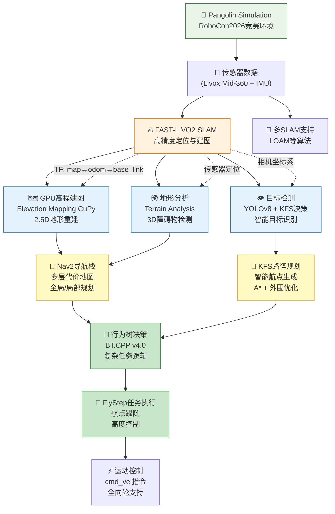
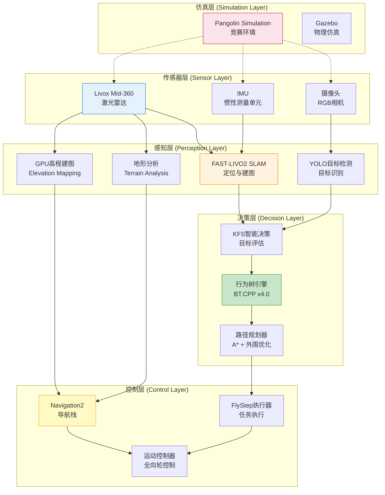

# SCURC 机器人导航仿真系统 (SCURC Navigation Simulation)

[](https://docs.ros.org/en/humble/)

[](https://releases.ubuntu.com/jammy/)

[](https://www.apache.org/licenses/LICENSE-2.0)

- **版本**: 1.0.0
- **状态**: 开发中 🚧
- **ROS版本**: ROS 2 Humble Hawksbill
- **Ubuntu版本**: Ubuntu 22.04 LTS
- **最后更新**: 2026年1月24日

### 📝 重要说明

1. **文档状态**: 本README暂未人工修正，仅作参考；项目构建步骤、依赖需自行验证。
2. **构建指南**: 项目构建步骤已在本文档中说明，如遇问题可优先参考各模块内的README.md。
3. **版本兼容**: 当前文档基于ROS 2 Humble + Ubuntu 22.04环境编写。
4. **技术支持**: 如遇问题，请查看[常见问题](#-常见问题-faq)部分或提交[GitHub Issue](https://github.com/OH1412/SCURC_Nav_Sim/issues)。
5. **实车分支**: 用于真实机器人部署的代码和针对硬件的改动位于 Git 分支 `real_vehicle`。该分支包含对硬件驱动、串口/网络通信、传感器校准及安全限制的变更，可能与 `master` 分支存在不兼容处。仅在确认目标平台与依赖并完成充分测试后再切换并部署到真实机器人。切换示例：

```bash
# 获取最新远端分支并切换到实车分支
git fetch origin
git checkout real_vehicle
```

若该分支包含额外部署说明，请参阅仓库中 `real_vehicle/README.md`。

### 🔍 快速导航

#### 📋 基础信息
- [📖 项目简介](#-项目简介)
- [🏗️ 系统架构](#️-系统架构)
- [🚀 核心功能](#-核心功能)
- [📈 性能基准](#-核心功能)
- [📋 系统要求](#-系统要求)

#### 🛠️ 部署指南
- [🛠️ 安装指南](#️-安装指南)
- [🎯 使用指南](#-使用指南)
- [📊 核心配置](#-核心配置)

#### 🔧 开发与维护
- [📚 关键组件详解](#-关键组件详解)
- [🔧 开发与调试](#-开发与调试)
- [❓ 常见问题 (FAQ)](#-常见问题-faq)
- [🤝 贡献指南](#-贡献指南)

#### 📞 联系与支持
- [📄 许可证](#-许可证)
- [📞 联系方式](#-联系方式)

## 📖 项目简介

SCURC导航仿真系统是一个专为 **RoboCon机器人竞赛** 打造的全自主移动机器人导航与智能任务执行平台。基于 **ROS 2 Humble** 构建，集成了从底层传感器处理到高层任务规划的完整技术栈，实现了 **竞赛级** 的自主导航性能。

该系统深度集成了 **FAST-LIVO2高精度SLAM**、**GPU加速地形分析**、**多层代价地图导航**、**行为树智能决策**、**YOLO目标检测**、**KFS路径规划** 等先进技术，支持在复杂3D环境中实现毫秒级定位、实时避障和智能任务执行。

### 系统架构与数据流



---

## 🏗️ 系统架构

### 技术架构总览



### 核心模块架构

<details>
<summary>点击展开完整目录结构</summary>

```
SCURC_Nav_Sim/
├── src/
│   ├── core_navigation/                 # ROS2 Navigation2 核心导航栈
│   │   └── navigation2/                 # Nav2完整生态系统
│   ├── dependencies_and_tools/          # 依赖工具和算法包
│   │   ├── autonomous_exploration_development_environment/  # 自主探索开发环境
│   │   ├── BehaviorTree.CPP/            # 行为树决策框架 (BT.CPP v4.0+)
│   │   ├── elevation_mapping_cupy_ros2/ # GPU加速高程建图 (CuPy)
│   │   ├── fast_livo2_relocation/       # FAST-LIVO2 SLAM + 重定位
│   │   ├── livox_ros_driver2/           # Livox激光雷达驱动
│   │   └── control_panel/               # 控制面板 (开发中)
│   ├── navigation_plugins/              # 导航扩展插件
│   │   └── nav2_ext_plugins/            # Nav2扩展插件集合
│   │       ├── behavior_ext_plugins/    # 行为插件扩展
│   │       ├── costmap_intensity/       # 强度代价地图层
│   │       ├── grid_map/               # GridMap生态系统
│   │       └── velocity_smoother_ext/   # 速度平滑器扩展
│   ├── robot_functionality/             # 机器人功能模块
│   │   ├── kfs_detection_nav/           # KFS目标检测与导航
│   │   ├── r2_bringup/                  # 机器人启动配置 (Launch/Params)
│   │   ├── rc_decision/                 # 决策模块
│   │   │   └── fly_step_mission/        # FlyStep航点任务执行
│   │   ├── rc_interfaces/               # ROS2接口定义
│   │   │   ├── fly_step_msgs/           # FlyStep消息定义
│   │   │   └── yolov8_ros2_msgs/        # YOLOv8消息定义
│   │   └── yolo_simulator/              # YOLO检测模拟器
│   ├── simulation_environment/          # 仿真环境
│   │   ├── gazebo_for_humble/           # Gazebo仿真环境
│   │   └── rc_robot_simulation/         # 机器人仿真模型
│   │       ├── livox_laser_simulation_RO2/  # Livox仿真
│   │       └── pangolin_simulation/     # Pangolin专用仿真
│   └── yolo_ros2_ws/                    # YOLO ROS2工作空间
│       └── yolov8_ros2/                 # YOLOv8 ROS2集成
├── load_all.sh                         # 环境加载脚本
└── README.md
```

</details>

### 技术栈

| 核心组件 | 技术栈 | 版本要求 | 关键特性 |
|----------|--------|----------|----------|
| **基础环境** | Ubuntu + ROS 2 | 22.04 LTS + Humble | Jammy + LTS版本 + DDS通信 |
| **编程语言** | C++17 + Python | GCC 11+ + 3.10 | 智能指针+STL + ROS2推荐 + 类型注解 |
| **GPU加速** | CUDA + CuPy | 12.x + 12.x | 并行计算 + NumPy兼容GPU数组 |
| **深度学习** | PyTorch + YOLOv8 | 2.x + Ultralytics | 动态图推理 + 实时多类别检测 |
| **定位建图** | FAST-LIVO2 + 多SLAM | 重定位版 + LOAM | 激光惯性融合100Hz + 算法切换支持 |
| **导航控制** | Navigation2 + Nav2插件 | ROS2原生 + 扩展 | 插件化架构 + 代价地图层 + 智能后退 |
| **决策规划** | BehaviorTree.CPP | v4.0+ | 可视化调试 + 异步执行 + XML配置 |
| **感知处理** | GridMap + Elevation | 多层网格 + GPU加速 | 地形融合 + 实时2.5D重建 |
| **传感器** | Livox Mid-360 | 激光雷达 | 非重复扫描 + 100m范围 + 3D感知 |
| **仿真平台** | Gazebo + Pangolin | 11.x + RoboCon2026 | ODE物理引擎 + 竞赛专用场地 + 多场景 |

---

## 🚀 核心功能

### 1. 🎯 高精度定位系统
- **多SLAM算法支持**: FAST-LIVO2（推荐）+ LOAM等算法无缝切换
- **高精度重定位**: ICP算法支持大范围环境快速重定位，回环检测
- **Livox Mid-360优化**: 专门针对Livox激光雷达的性能优化，实时高频定位
- **IMU紧耦合**: 激光-惯性融合，支持动态环境和高机动运动

### 2. 🗺️ GPU加速地形感知
- **实时高程建图**: CuPy GPU加速，毫秒级2.5D地形重建
- **多层地形数据**: elevation（高度）、variance（方差）、traversability（可通行度）
- **高级地形分析**: 坡度分析、动态障碍物清除、3D可通行性评估
- **GridMap集成**: 完整的GridMap生态系统，支持复杂地形导航

### 3. 🧭 智能导航控制系统
- **Navigation2完整栈**: ROS2官方导航框架，全组件集成
- **多层代价地图**: 静态层、障碍物层、强度感知层、膨胀层等
- **全局/局部规划**: A*全局规划 + DWB局部控制，支持自定义插件
- **3D地形导航**: 基于地形分析的复杂地形路径规划

### 4. 🎮 行为树智能决策
- **BT.CPP v4.0**: 工业级行为树框架，支持复杂任务逻辑
- **错误恢复机制**: 自动重规划、重试、后备策略
- **任务级决策**: 支持多目标任务规划和执行优先级
- **实时调试**: Groot可视化工具集成

### 5. 👁️ 视觉智能感知
- **YOLOv8目标检测**: PyTorch深度学习框架，实时多目标检测
- **KFS智能决策**: 真假目标识别、安全状态评估、优先级决策
- **多模态融合**: 视觉+激光雷达数据融合，提升检测可靠性
- **KFSDecision消息**: 结构化决策信息，包含60个航点状态

### 6. 🏁 RoboCon竞赛解决方案
- **Pangolin Simulation**: 2026 RoboCon专用仿真环境
- **完整比赛场地**: 带墙/无墙赛道，12个KFS目标点
- **全向轮机器人**: 专业的竞赛机器人模型和控制算法
- **任务执行系统**: FlyStep航点任务，支持复杂比赛策略

### 7. 🔧 高级开发工具
- **模块化架构**: 74个ROS2功能包，支持灵活配置和扩展
- **多环境支持**: 仿真环境、测试环境、生产环境无缝切换
- **性能监控**: 完整的系统状态监控和性能分析工具
- **开发友好**: 详细的文档、示例代码和调试工具

### 8. 📈 性能基准
- **定位精度**: FAST-LIVO2 毫米级(室内环境)
- **处理频率**: 100Hz SLAM输出，实时地形重建 < 5ms/帧
- **导航响应**: 规划延迟 < 100ms，控制周期 50Hz
- **内存占用**: GPU加速模式下 < 4GB RAM
- **通信延迟**: ROS2 DDS < 1ms节点间通信

---

## 📋 系统要求

### 硬件配置

| 组件 | 最低配置 | 推荐配置 | 说明 |
|------|----------|----------|------|
| **CPU** | Intel i5 / AMD Ryzen 5 | Intel i7 / AMD Ryzen 7 | 编译和运行需要多核支持 |
| **内存** | 16GB RAM | 32GB RAM | 高程建图和SLAM需要大量内存 |
| **GPU** | (可选) | NVIDIA RTX 4050 (12GB+) | CUDA 12.x，仅高程地图需要 |
| **存储** | 5GB SSD | 100GB SSD | 包含所有依赖和构建产物 |
| **网络** | 千兆以太网 | 万兆以太网 | 大量传感器数据传输 |

### 传感器配置

- **激光雷达**: Livox Mid-360 (推荐) 或其他Livox系列
- **IMU**: 支持ROS标准IMU消息格式
- **摄像头**: 可选，用于YOLO目标检测
- **计算平台**: 支持Ubuntu 22.04的硬件平台

### 软件依赖

- **操作系统**: Ubuntu 22.04 LTS (Jammy Jellyfish)
- **ROS版本**: ROS 2 Humble Hawksbill (官方LTS)
- **CUDA版本**: 12.x (与CuPy严格匹配)
- **Python版本**: 3.10 (ROS 2 Humble要求)

---

## 🚀 快速开始

### 5分钟快速部署 (推荐新用户)

```bash
# 1. 一键环境准备
git clone https://github.com/OH1412/SCURC_Nav_Sim.git
cd SCURC_Nav_Sim
source ./load_all.sh

# 2. 启动完整仿真系统
ros2 launch r2_bringup simulation_bringup.launch.launch.py
```

**成功标志**: RViz中显示机器人模型、地图和导航路径，行为树开始执行航点任务。

---

## 🛠️ 安装指南

### 1. 基础环境准备

```bash
# 更新系统
sudo apt update && sudo apt upgrade -y

# 安装ROS 2 Humble (如遇密钥错误请参考ROS官方文档)
sudo apt install -y software-properties-common
sudo add-apt-repository universe
sudo apt update && sudo apt install -y curl
sudo curl -sSL https://raw.githubusercontent.com/ros/rosdistro/master/ros.key -o /usr/share/keyrings/ros-archive-keyring.gpg
echo "deb [arch=$(dpkg --print-architecture) signed-by=/usr/share/keyrings/ros-archive-keyring.gpg] http://packages.ros.org/ros2/ubuntu $(source /etc/os-release && echo $UBUNTU_CODENAME) main" | sudo tee /etc/apt/sources.list.d/ros2.list > /dev/null
sudo apt update
sudo apt install -y ros-humble-desktop ros-humble-grid-map-* ros-humble-gazebo-ros-pkgs ros-humble-pointcloud-to-laserscan

# 安装CUDA 12.x (请参考NVIDIA官网，必须安装)
# 验证安装: nvcc --version
```

### 2. 工作空间搭建

```bash
mkdir -p ~/SCURC_Nav_Sim/src
cd ~/SCURC_Nav_Sim

# 克隆项目
git clone https://github.com/OH1412/SCURC_Nav_Sim.git src
```

### 3. Python 环境配置 (⚠️ 关键步骤)

由于 `elevation_mapping_cupy` 依赖 GPU 加速库，推荐使用 **Conda** 管理环境以避免与系统 Python 冲突。

```bash
# 创建Conda环境
conda create -n sc_nav python=3.10
conda activate sc_nav

# 安装ROS2 Python依赖
pip install rospkg empy==3.3.4 catkin_pkg lxml transforms3d netifaces psutil
# ⚠️ 备注：empy版本需严格锁定3.3.4，否则会与ROS 2构建工具冲突。

# 安装科学计算库 (版本需与CUDA匹配)
pip install "numpy<2.0" "opencv-python<=4.9.0.80"
# ⚠️ 关键：根据你的CUDA版本安装对应的CuPy。例如CUDA 12.x：
pip install "cupy-cuda12x"
pip install "shapely>=1.8.0" scipy chainer
```

### 4. 编译工作空间

**⚠️ 编译前必读**：如果在编译 `grid_map_cv` 或 `grid_map_ros` 时遇到 `cv_bridge/cv_bridge.hpp: No such file` 错误，请修改报错文件中的 `#include <cv_bridge/cv_bridge.hpp>` 为 **`#include <cv_bridge/cv_bridge/cv_bridge.h>`**。

```bash
# 加载ROS2环境
source /opt/ros/humble/setup.bash

# 编译所有包 (使用-j防止内存溢出，--symlink-install方便调试)
# 首次编译可能较慢，请耐心等待
colcon build --symlink-install --cmake-args -DCMAKE_BUILD_TYPE=Release --jobs $(nproc --ignore=2)

# 加载编译结果
source install/setup.bash
```

### 5. 一键环境加载

项目提供了 `load_all.sh` 脚本，自动加载 ROS 2 环境、工作空间及 Gazebo 模型路径。

```bash
chmod +x load_all.sh
# 每次打开新终端时执行
source ./load_all.sh
```

---

## 🎯 使用指南

### 1. 启动仿真与可视化

```bash
# 终端 1: 启动Gazebo仿真环境 (加载机器人模型)
ros2 launch rc_robot_simulation simulation.launch.py

# 终端 2: 启动RViz可视化
ros2 launch r2_bringup rviz.launch.py
```

### 2. 启动定位与建图 (SLAM + Mapping)

```bash
# 终端 3: 启动Livox驱动与FAST-LIVO2定位
ros2 launch fast_livo mapping_avia.launch.py

# 终端 4: 启动GPU高程建图 (确保Conda环境已激活)
conda activate sc_nav
ros2 launch elevation_mapping_cupy elevation_mapping.launch.py
```

### 3. 启动导航栈 (Nav2)

```bash
# 终端 5: 启动Nav2及相关节点
ros2 launch r2_bringup r2_bringup.launch.py
```

### 4. 启动目标检测与决策 (可选)

```bash
# 终端 6: 启动YOLO目标检测
ros2 launch yolov8_ros2 yolov8_launch.py

# 终端 7: 启动KFS决策系统
ros2 launch kfs_detection_nav kfs_detection.launch.py
```

### 5. 启动智能航点任务 (可选)

```bash
# 启动完整KFS任务流程（包含航点规划）
ros2 launch r2_bringup dynamic_waypoint_mission.launch.py

# 或启动FlyStep行为树任务
ros2 launch fly_step_mission fly_step_mission_bt.launch.py
```

### 6. 功能验证 (验证各模块是否正常)

```bash
# 1. 检查节点存活
ros2 node list | grep -E "fast_livo|elevation|nav2|yolo|kfs"

# 2. 检查TF链完整性 (Nav2启动的关键)
# 必须看到 map -> odom -> base_link 的变换
ros2 run tf2_ros tf2_echo map base_link

# 3. 检查传感器数据流
ros2 topic hz /cloud_registered          # 点云数据
ros2 topic hz /kfs_decision             # KFS决策信息
ros2 topic hz /yolov8/BoundingBoxes     # YOLO检测结果

# 4. 检查导航状态
ros2 topic echo /behavior_tree_log       # 行为树日志
ros2 topic echo /plan                    # 导航路径规划
```

---

## 📊 核心配置

### 高程建图配置

编辑 `src/dependencies_and_tools/elevation_mapping_cupy_ros2/config/core/core_param.yaml`:

```yaml
# 地图参数
resolution: 0.05          # 分辨率 (米)
map_length: 20.0          # 地图边长 (米)
cell_n: 160000           # 总格子数

# 传感器配置
subscribers:
  pointcloud1:
    topic_name: '/cloud_registered'  # 点云话题
    data_type: 'pointcloud'

# 坐标系设置
map_frame: 'odom'         # 地图坐标系
base_frame: 'base_link'   # 机器人基坐标系
```

### 导航参数配置

编辑 `src/robot_functionality/r2_bringup/params/nav2_params.yaml`:

```yaml
# 全局规划器
planner_server:
  ros__parameters:
    planner_plugins: ["GridBased"]
    GridBased:
      plugin: "nav2_navfn_planner/NavfnPlanner"
      use_astar: true

# 局部规划器
controller_server:
  ros__parameters:
    controller_plugins: ["FollowPath"]
    FollowPath:
      plugin: "dwb_core::DWBLocalPlanner"
```

---

## ❓ 常见问题 (FAQ)

### 1. 启动节点时报错 `ModuleNotFoundError: No module named 'cupy'`？

  * **原因**：ROS 节点运行的 Python 环境没有安装 CuPy，或者版本与 CUDA 不匹配。
  * **解决**：确保在启动 `elevation_mapping` 的终端中激活了安装有 `cupy-cuda12x` 的 Conda 环境 (`conda activate sc_nav`)。

### 2. Nav2 报错 `Computing map coords failed`？

  * **原因**：TF 树断裂或时钟不同步。
  * **解决**：
    1. 检查 `fast_livo` 是否正常发布 `/odom` 到 `/map` 的变换。
    2. 如果使用仿真，确保所有 Launch 文件中 `use_sim_time` 都设置为 `true`。

### 3. 编译时提示找不到 `cv_bridge` 头文件？

  * **原因**：ROS 2 Humble 中 `cv_bridge` 的头文件路径结构发生了变化。
  * **解决**：按照[安装指南](#️-安装指南)中的提示，手动修改源码中的 `#include` 路径。

### 4. Gazebo仿真启动失败？

  * **原因**：Gazebo插件路径或模型路径配置错误。
  * **解决**：
    1. 确保正确执行了 `source ./load_all.sh`
    2. 检查 `GAZEBO_PLUGIN_PATH` 和 `GAZEBO_MODEL_PATH` 环境变量
    3. 验证Gazebo版本是否为11.x

### 5. 行为树执行异常或卡住？

  * **原因**：Nav2导航服务未正确启动，或TF变换断裂。
  * **解决**：
    1. 检查Nav2生命周期状态：`ros2 lifecycle get /controller_server`
    2. 验证TF链：`ros2 run tf2_ros tf2_echo map base_link`
    3. 查看行为树日志：`ros2 topic echo /behavior_tree_log`

### 6. KFS规划器无输出或路径规划失败？

  * **原因**：KFSDecision消息未发布，或航点配置错误。
  * **解决**：
    1. 检查YOLO和KFS检测节点状态
    2. 验证KFSDecision话题：`ros2 topic echo /kfs_decision`
    3. 确认航点文件路径正确且格式有效

### 7. 导航精度不佳或频繁重规划？

  * **原因**：SLAM漂移、地图质量差，或代价地图参数不当。
  * **解决**：
    1. 检查FAST-LIVO2定位状态和回环检测
    2. 调整代价地图参数（膨胀半径、安全距离）
    3. 优化Nav2规划器参数（容差设置）

### 8. 系统资源占用过高？

  * **原因**：未正确配置GPU加速，或多节点重复计算。
  * **解决**：
    1. 确保elevation_mapping使用GPU加速
    2. 调整SLAM和建图的频率参数
    3. 优化RViz显示设置，减少可视化开销

### 9. 多机协作时通信异常？

  * **原因**：ROS2 DDS配置或网络设置问题。
  * **解决**：
    1. 配置ROS_DOMAIN_ID环境变量
    2. 检查网络连接和防火墙设置
    3. 使用专用DDS配置优化通信性能

---

## 🔧 开发与调试

### RViz可视化配置

1. 启动RViz2
2. 添加GridMap插件
3. 设置Topic为 `/elevation_mapping/elevation_map_filter`
4. 设置Layer为 `elevation`
5. 设置Fixed Frame为 `odom`

### 日志与调试

```bash
# 查看节点状态
ros2 node list

# 查看话题列表
ros2 topic list

# 查看服务列表
ros2 service list

# 监控特定话题
ros2 topic echo /cmd_vel
```

### 性能监控

```bash
# 监控系统资源使用
ros2 run rqt_runtime_monitor rqt_runtime_monitor

# 查看节点计算图
ros2 run rqt_graph rqt_graph
```

---

## 📚 关键组件详解

### 1. 🎯 定位与建图核心

#### FAST-LIVO2 SLAM系统 (`fast_livo2_relocation`)
- **核心算法**: 激光-惯性紧耦合里程计，基于预积分和滑动窗口优化
- **实时性能**: 支持100Hz高频定位输出，延迟<10ms
- **重定位功能**: ICP算法支持大范围环境快速重定位
- **传感器优化**: 专门为Livox Mid-360优化，处理非重复扫描模式
- **输出接口**: `/Odometry`, `/cloud_registered`, `/path`, `/map`
- **关键特性**: 回环检测、动态环境适应、外参在线标定

#### GPU加速高程建图 (`elevation_mapping_cupy_ros2`)
- **并行计算**: CuPy GPU加速，单帧处理<5ms
- **多层融合**: elevation/variance/traversability三层数据
- **实时更新**: 卡尔曼滤波融合多帧数据，消除传感器噪声
- **地形重建**: 2.5D高程地图，支持复杂3D地形表示
- **Nav2集成**: 通过GridMap接口无缝集成到导航栈
- **内存优化**: 自适应分辨率，平衡精度和性能

#### 高级地形分析 (`autonomous_exploration_development_environment`)
- **3D感知**: 基于注册点云的实时地形分析
- **动态避障**: 滑动窗口动态障碍物检测和清除
- **坡度计算**: 分位数法计算地形坡度，避免凹凸面干扰
- **可通行性**: 实时评估地形可通行度，支持轮式/足式机器人
- **运动规划**: 基于运动原语的局部路径规划

### 2. 🧭 智能导航控制

#### Navigation2完整栈 (`core_navigation/navigation2`)
- **架构设计**: 全局规划器 + 局部控制器 + 代价地图 + 行为服务器
- **插件系统**: 支持自定义规划器、控制器、行为插件
- **多机器人**: 原生支持多机器人协作和冲突避免
- **生命周期**: 完整的ROS2生命周期管理，确保系统稳定性

#### Nav2扩展插件 (`navigation_plugins/nav2_ext_plugins`)
- **强度感知层**: 基于激光强度信息的代价地图层
- **智能后退行为**: BackUpTwzFree算法，寻找自由空间安全后退
- **速度平滑器**: 高级速度平滑算法，减少电机磨损
- **GridMap集成**: 完整的GridMap代价地图层支持

#### FlyStep任务执行 (`robot_functionality/rc_decision/fly_step_mission`)
- **航点系统**: 12主航点 + 48边界点，共60个预定义位置
- **路径规划**: A*算法 + 外围跑道优化，最短路径计算
- **高度控制**: 受控上升/下降，支持多层平台导航
- **行为树集成**: 与BT.CPP深度集成，支持复杂任务逻辑
- **KFS规划**: 智能目标选择和路径规划

### 3. 👁️ 智能感知决策

#### KFS检测与决策 (`robot_functionality/kfs_detection_nav`)
- **多模态融合**: YOLO视觉检测 + 激光雷达距离测量
- **智能决策**: 真假KFS识别算法，基于置信度和几何特征
- **安全评估**: 三级安全状态（SAFE/WARNING/DANGER）
- **优先级排序**: 基于距离和置信度的目标优先级排序
- **实时通信**: KFSDecision消息，包含完整的决策信息

#### YOLO目标检测 (`yolo_ros2_ws/yolov8_ros2`)
- **深度学习**: PyTorch + Ultralytics YOLOv8，实时推理
- **多类别检测**: 支持KFS、机器人、人等多个目标类别
- **性能优化**: GPU加速，张量RT优化，批处理推理
- **ROS2集成**: 完整的消息接口和生命周期管理

### 4. 🏁 竞赛级仿真平台

#### Pangolin Simulation (`simulation_environment/rc_robot_simulation/pangolin_simulation`)
- **竞赛专用**: 专门为RoboCon2026设计，包含完整比赛规则
- **场地建模**: 精确的比赛场地几何模型和物理属性
- **传感器仿真**: Livox激光雷达、IMU、相机的真实物理仿真
- **性能优化**: Gazebo优化配置，支持实时仿真
- **多场景**: 带墙/无墙赛道，调试/比赛模式

#### Gazebo通用环境 (`simulation_environment/gazebo_for_humble`)
- **插件系统**: 自定义控制器插件，支持全向轮运动学
- **多机器人**: 支持多机器人同时仿真
- **传感器集成**: 完整的传感器数据生成和发布
- **物理引擎**: ODE物理引擎，支持复杂动力学仿真

### 5. 🔧 开发工具框架

#### BehaviorTree.CPP (`dependencies_and_tools/BehaviorTree.CPP`)
- **工业级框架**: v4.0，支持异步执行和并发
- **可视化调试**: Groot工具集成，支持运行时监控
- **插件系统**: 丰富的内置节点，自定义节点扩展
- **XML配置**: 声明式任务定义，支持复杂逻辑表达

#### ROS2接口定义 (`robot_functionality/rc_interfaces`)
- **消息标准化**: 统一的接口定义，确保模块间兼容性
- **服务接口**: SetMainWPs服务，支持动态航点设置
- **类型安全**: 强类型消息定义，编译时类型检查
- **扩展性**: 模块化设计，支持新消息类型添加

#### Livox传感器驱动 (`dependencies_and_tools/livox_ros_driver2`)
- **高性能通信**: 零拷贝数据传输，时间同步
- **多型号支持**: 支持Mid-360、Avia、Horizon等系列
- **CustomMsg格式**: ROS2优化格式，减少序列化开销
- **故障恢复**: 自动重连和错误恢复机制

### 6. 📊 性能监控与调优

#### 系统性能监控
```bash
# CPU/GPU使用率监控
ros2 run rqt_runtime_monitor rqt_runtime_monitor

# 节点通信图分析
ros2 run rqt_graph rqt_graph

# 话题带宽监控
ros2 topic hz /cloud_registered
ros2 topic bw /yolov8/BoundingBoxes

# TF变换监控
ros2 run tf2_tools view_frames.py
```

#### 关键性能指标

| 组件 | 目标性能 | 监控方法 |
|------|----------|----------|
| **FAST-LIVO2** | 100Hz定位输出 | `ros2 topic hz /Odometry` |
| **高程建图** | <5ms/帧处理 | GPU监控工具 |
| **YOLO检测** | >10FPS推理 | `ros2 topic hz /yolov8/BoundingBoxes` |
| **Nav2规划** | <100ms响应 | 行为树日志分析 |
| **通信延迟** | <1ms DDS通信 | ROS2工具链监控 |

#### 性能调优建议

- **SLAM调优**: 调整滑动窗口大小和特征提取参数
- **建图优化**: 平衡分辨率和更新频率，根据场景调整
- **导航优化**: 调整代价地图层权重和规划器参数
- **通信优化**: 使用适当的QoS策略和消息频率控制

---

## 🤝 贡献指南

### 开发流程

1. **准备工作**
   - Fork 项目到个人仓库
   - 克隆到本地：`git clone https://github.com/YOUR_USERNAME/SCURC_Nav_Sim.git`
   - 创建功能分支：`git checkout -b feature/amazing-feature`

2. **代码开发**
   - 遵循ROS2和C++/Python编码规范
   - 添加必要的单元测试和文档
   - 确保代码通过编译和运行测试

3. **提交规范**
   ```bash
   # 提交信息格式
   git commit -m "feat: 添加新的导航算法优化
   - 实现A*路径规划改进
   - 添加地形代价函数
   - 更新相关配置文件"
   ```

4. **测试验证**
   - 在仿真环境中测试新功能
   - 验证与现有模块的兼容性
   - 性能测试确保无性能退化

5. **提交PR**
   - 推送到个人仓库：`git push origin feature/amazing-feature`
   - 在GitHub上创建Pull Request
   - 详细描述变更内容和测试结果

### 代码规范

#### ROS2 包开发规范
- **包命名**: 使用snake_case，清晰表达功能
- **消息定义**: 在interface包中统一管理
- **参数配置**: 使用YAML文件，支持运行时调整
- **日志输出**: 使用ROS2日志系统，适当设置日志级别

#### C++ 编码规范
- **标准**: C++17, 使用智能指针和STL容器
- **命名**: 类使用PascalCase，函数和变量使用snake_case
- **注释**: Doxygen格式，函数接口要有完整说明
- **异常处理**: 使用适当的异常处理，避免程序崩溃

#### Python 编码规范
- **标准**: PEP 8, 使用类型注解
- **导入**: 分层导入，标准库→第三方库→本地模块
- **文档**: 使用Google风格docstring
- **测试**: 提供完整的单元测试覆盖

### 文档要求

- **README**: 为新增模块提供完整的README文档
- **API文档**: 重要接口要有详细的参数说明和使用示例
- **配置说明**: 参数文件要有清晰的注释和取值范围
- **使用指南**: 提供从安装到运行的完整教程

### 测试要求

- **单元测试**: 为核心算法提供单元测试
- **集成测试**: 验证模块间接口的正确性
- **性能测试**: 确保功能优化不影响系统性能
- **回归测试**: 修改现有功能时要验证兼容性

### 评审标准

PR评审将检查：
- ✅ 代码质量和规范性
- ✅ 功能完整性和正确性
- ✅ 文档完整性和准确性
- ✅ 测试覆盖率和有效性
- ✅ 对现有功能的兼容性
- ✅ 性能影响评估

---

## 📄 许可证

本项目采用 [Apache 2.0 许可证](LICENSE) 开源。第三方依赖包遵循其原始协议。

---


---

## 📞 联系方式

- **项目维护者**: [Pangolin战队](https://github.com/mose1s/RC_vision_2026) @[OH](https://github.com/OH1412)
- **贡献者**: [Pangolin战队全体成员](https://github.com/mose1s/RC_vision_2026)
- **技术支持**: [GitHub Issues](https://github.com/OH1412/SCURC_Nav_Sim/issues)  
- **文档**: [项目Wiki](https://github.com/OH1412/SCURC_Nav_Sim/wiki)

---

## 🗺️ 路线图 (Roadmap)

### 已完成 ✅
- [x] RoboCon2026竞赛级导航系统
- [x] FAST-LIVO2 + GPU高程建图核心
- [x] 74个ROS2功能包集成
- [x] Pangolin专用仿真环境
- [x] KFS智能目标检测与决策
- [x] BehaviorTree.CPP任务规划
- [x] 60航点FlyStep任务执行

### 进行中 🚧
- [ ] KFS自动摆放
- [ ] 强化学习路径优化

### 计划中 📋
- [ ] 边缘计算部署方案
- [ ] 自动参数调优系统

### 长期愿景 🎯
- [ ] 开源自动导航决策框架

---

*最后更新: 2026年1月24日*
